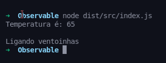
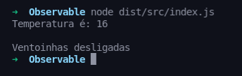

# Observer #design/pattern
## **Observer** é um padrão de design de código que permite observar o estado de uma classe e atualizar se quiser o próprio estado.

#### Exemplo com Weather Station
### Primeiro declaramos a interface de quem será observado e do observador respectivamente: 

### Após isso criamos a classe Weather Station, implementando a interface Subject:
### Repare que ao setar uma nova temperatura, os observadores que forem adicionados ao array observers serão notificados:

### Criamos a classe Fan que é um observador de WeatherStation
### Repare que no construtor ele recebe como parâmetro o objeto que será observado e passa a si próprio como parâmetro para o registerObserver da classe WeatherStation:

### Instanciando as classes weatherStation() e Fan(weatherStation), vemos como acontece o comportamento de Fan quando alteramos algum valor de WeatherStation: 

