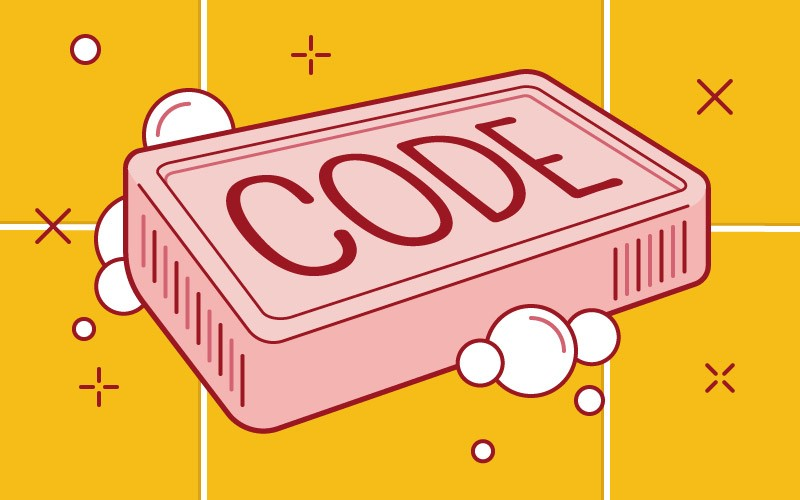

# S.O.L.I.D. #BoasPraticas #CleanCode

## Conjunto de princípios da [[POO]]

# S - Princípio de Responsabilidade Única
##### *"Uma classe deve ter apenas um motivo para mudar"*
## Esse princípio trata da coesão das classes, ou seja, que suas funcionalidades sejam específicas para a classe.
```javascript
errado:
	class Aluno{
		ler(){}
		escrever(){}
		conectarDB(){} //<--- função deve ser de outra classe
	}
```
	
```javascript
melhor:
	class Aluno{
		nota: number
		getNota: ()=>{}
		setNota: ()=>{}
		
		ler(){}
		escrever(){}
		perguntar(){}
	}
```
#language JavaScript

# O - Princípio Open-Closed
##### *"As entidades de software (classes, módulos, funções etc.) devem ser abertas para ampliação, mas fechadas para serem modificadas"*.
## De curto e grosso modo, entidades de software que seguem esse princípio não devem ser modificadas com alterações no código fonte, apenas ampliadas, fazendo uso de interfaces, heranças e composições.
```php
	ruim:
		class ContratoClt
		{
			public function salario()
			{
				/*...*/
			}
		}
			
		class Estagio
		{
			public function bolsaAuxilio()
			{
				/*...*/
			}
		}
			
		class FolhaDePagamento
		{
			protected $saldo;
		
			public function calcular($funcionario)
			{
				if ( $funcionario instanceof ContratoClt ) {

					$this->saldo = $funcionario->salario();

				} else if ( $funcionario instanceof Estagio) {
				
					$this->saldo = $funcionario->bolsaAuxilio();

				}
			}
	
		}
```

```php
	melhor:
		interface Remuneravel
		{
			public function remuneracao();
		}

		class ContratoClt implements Remuneravel
		{
			public function remuneracao()
			{
				/*...*/
			}
		}

		class Estagio implements Remuneravel
		{
			public function remuneracao()
			{
				/*...*/
			}
		
		}

		class FolhaDePagamento
		{
			protected $saldo;
		
			public function calcular(Remuneravel $funcionario)
			{
				$this->saldo = $funcionario->remuneracao();
			}

		}
```
#language PHP
# L - Princípio de Substituição de Liskov
##### *"Uma classe derivada deve ser substituível por sua classe base."*
## Ou seja, quando novos comportamentos e recursos precisam ser adicionados no software, devemos estender e não alterar o código fonte original.

## Mesmo a herança sendo um mecanismo poderoso, ela deve ser utilizada de forma contextualizada e moderada, evitando os casos de classes serem estendidas apenas por possuírem algo em comum.
```php
	ruim:
	# - Sobrescrevendo um método que não faz nada...
	# - Um voluntário não tem remuneração, então nao deveria ser extendida por 
        #ContratoDeTrabalho
	class Voluntario extends ContratoDeTrabalho
	{
	
		public function remuneracao()
		{
		
		// não faz nada
		
		}
	
	}
	
	# - Lançando uma exceção inesperada...	
	class MusicPlay
	{
		public function play($file)
		
		{
		
			// toca a música
		
		}
	}
	
	class Mp3MusicPlay extends MusicPlay
	{
		public function play($file)
		{
			if (pathinfo($file, PATHINFO_EXTENSION) !== 'mp3') {
			
			throw new Exception;
			}
		// toca a música
		}
	}
	
	# - Retornando valores de tipos diferentes...
	class Auth
	{
		public function checkCredentials($login, $password)
		{
		// faz alguma coisa
			
			return true; # boolean
		}
	
	}
	
	class AuthApi extends Auth
	{
		public function checkCredentials($login, $password)
		{
		// faz alguma coisa
			return ['auth' => true, 'status' => 200]; # array relacional
		}
	}

```

```php
	na prática:

	class A
	{
		public function getNome()
		{
			echo 'Meu nome é A';
		}
	}

	class B extends A
	{
		public function getNome()
		{
			echo 'Meu nome é B';
		}
	}

	$objeto1 = new A;
	
	$objeto2 = new B;
	
	function imprimeNome(A $objeto)
	{
		return $objeto->getNome();
	}
	
	imprimeNome($objeto1); // Meu nome é A
	
	imprimeNome($objeto2); // Meu nome é B
	
```
#language PHP
# I - Princípio da Segregação de Interface
##### *"Uma classe não deve ser forçada a implementar interfaces e métodos que não irão utilizar."*
## Esse princípio diz que é melhor criar interfaces mais específicas ao invés de termos uma única interface genérica.

```php
	ruim:
	// Neste exemplo podemos ver que Pinguim é uma ave, porém não voa e está implementando funções que não são atribuíveis para ela

	interface Aves
	{
		public function setLocalizacao($longitude, $latitude);
		
		public function setAltitude($altitude);
		
		public function renderizar();
	}

	class Papagaio implements Aves
	{
		public function setLocalizacao($longitude, $latitude)
		{
			//Faz alguma coisa
		}
	
		public function setAltitude($altitude)
		{
			//Faz alguma coisa
		}
		
		public function renderizar()
		{
			//Faz alguma coisa
		
		}
	
	}

	class Pinguim implements Aves
	{
		public function setLocalizacao($longitude, $latitude)
		{
			//Faz alguma coisa
		
		}
		
			// A Interface Aves está forçando a Classe Pinguim a implementar esse método.
			
			// Isso viola o príncipio ISP
		
		public function setAltitude($altitude)
		{
		
			//Não faz nada... Pinguins são aves que não voam!
		
		}
		public function renderizar()
		{
			//Faz alguma coisa
		
		}
	
	}

```

```php
	melhor:
	interface Aves
	{
		public function setLocalizacao($longitude, $latitude);
		
		public function renderizar();
	}

	interface AvesQueVoam extends Aves
	{
		public function setAltitude($altitude);
	}
	
	class Papagaio implements AvesQueVoam
	{
		public function setLocalizacao($longitude, $latitude)
		{
			//Faz alguma coisa
		}
		
		public function setAltitude($altitude)
		{
			//Faz alguma coisa
		
		}
		
		public function renderizar()
		{
			//Faz alguma coisa
		
		}
	
	}
	
	class Pinguim implements Aves
	{
		public function setLocalizacao($longitude, $latitude)
		{
			//Faz alguma coisa
		
		}
		
		public function renderizar()
		{
			//Faz alguma coisa
		
		}
	
	}

```
#language PHP

# D - Princípio de Inversão de Dependência
##### *"Dependa de abstrações e não de implementações."*
### 1. Módulos de alto nível não devem depender de módulos de baixo nível. Ambos devem depender da abstração.

### 2. Abstrações não devem depender de detalhes. Detalhes devem depender de abstrações...
```php
	ruim: 
	use MySQLConnection;
	
	class PasswordReminder
	{
		private $dbConnection;
	
		public function __construct()
		{
			$this->dbConnection = new MySQLConnection();
		}
		// Faz alguma coisa
	}

	Injeção de depêndencia porém ainda ruim:
	use MySQLConnection;

	class PasswordReminder
	{
		private $dbConnection;

		public function __construct(MySQLConnection $dbConnection)
		{
			$this->dbConnection = $dbConnection;
		
		}
		// Faz alguma coisa
	
	}
```
```php
	melhor:
	interface DBConnectionInterface
	{
		public function connect();
	}
	
	class MySQLConnection implements DBConnectionInterface
	{
		public function connect()
		{
			// ...
		}
	}
	
	class OracleConnection implements DBConnectionInterface
	{
		public function connect()
		{
			// ...
		}
	}
	
	class PasswordReminder
	{
		private $dbConnection;
		
		public function __construct(DBConnectionInterface $dbConnection) 
		{
			$this->dbConnection = $dbConnection;
		}
		// Faz alguma coisa
	}
```

## A sistemática dos princípios **SOLID** tornam o software mais robusto, escalável e flexível, deixando-o tolerante a mudanças, facilitando a implementação de novos requisitos para a evolução e manutenção do sistema.
<https://medium.com/desenvolvendo-com-paixao/o-que-%C3%A9-solid-o-guia-completo-para-voc%C3%AA-entender-os-5-princ%C3%ADpios-da-poo-2b937b3fc530/>